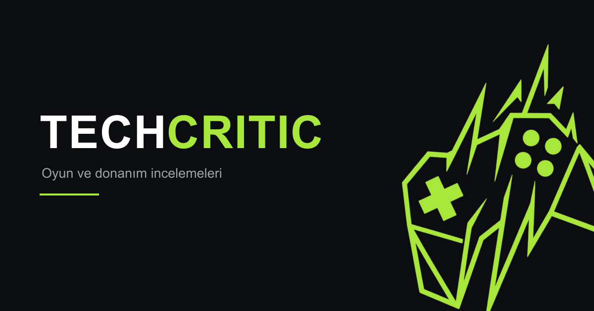

<div align="center">



**Oyun ve donanım incelemeleri için baştan sona kurulmuş, headless CMS destekli inceleme platformu.**

[](https://react.dev)
[](https://vite.dev)
[](https://tailwindcss.com)
[](https://strapi.io)
[](https://www.postgresql.org)

[**Canlı Site**](https://techcritic.netlify.app) · [Yönetim Paneli](https://react-strapi-game-critic-site.onrender.com/admin)

</div>

---

## İçindekiler

- [Proje Hakkında](#proje-hakkında)
- [Özellikler](#özellikler)
- [Mimari](#mimari)
- [Teknoloji Yığını](#teknoloji-yığını)
- [Proje Yapısı](#proje-yapısı)
- [Kurulum](#kurulum)
- [Ortam Değişkenleri](#ortam-değişkenleri)
- [İçerik Modeli](#i̇çerik-modeli)
- [Yayına Alma](#yayına-alma)
- [Öne Çıkan Teknik Kararlar](#öne-çıkan-teknik-kararlar)
- [Bilinen Sınırlar](#bilinen-sınırlar)

---

## Proje Hakkında

**TechCritic**, oyun ve donanım incelemelerinin yayınlandığı Türkçe bir eleştiri sitesi. İçerik yönetimi için ayrı bir panele girmeye gerek yok — editör, doğrudan sitenin kendi arayüzünden giriş yapıp zengin metin editörüyle inceleme yazıyor, kapak görseli yüklüyor ve yayınlıyor.

Tasarım dili bilinçli olarak "ölçüm cihazı" estetiğine yaslanıyor: yuvarlatılmış köşeler ve gradyan yerine keskin hatlar, tek bir fosfor yeşili vurgu rengi (`#a8e83c`), koyu bir taban (`#0b0d10`) ve puanlar/tarihler için tabular rakamlı monospace font.

## Özellikler

**Ziyaretçi tarafı**
- Öne çıkan incelemenin tam genişlikte vitrin bölümü
- Kategoriye göre anlık filtreleme
- 10 üzerinden puan rozeti, artı/eksi listeleri, zengin metin gövdesi
- Geri dönüşte kaldığın kaydırma konumunun korunması
- Mobil uyumlu, kaydırmaya duyarlı navigasyon

**Editör tarafı**
- Site üzerinden JWT ile giriş
- Tiptap tabanlı zengin metin editörü (başlık, kalın, italik, üstü çizili, alıntı, liste, kod)
- Sürükle-bırak kapak görseli yükleme (Cloudinary'ye gidiyor)
- Başlıktan otomatik, Türkçe karakter duyarlı slug üretimi
- Yayınlanmış incelemeleri düzenleme ve silme
- Korumalı rotalar; süresi dolmuş oturumun otomatik temizlenmesi

**Altyapı**
- Kalıcı görsel barındırma (Cloudinary)
- Kaynak kısıtlı CORS
- Güvenlik başlıkları, `robots.txt`, `sitemap.xml`, Open Graph / Twitter kartları
- Sayfa bazlı dinamik `<title>` ve meta açıklamaları

## Mimari

```
┌──────────────────┐         ┌──────────────────┐         ┌──────────────────┐
│    Netlify       │  REST   │     Render       │         │   Neon / PG      │
│                  │ ──────► │                  │ ──────► │                  │
│  React + Vite    │  JWT    │   Strapi v5      │         │   PostgreSQL     │
│  (statik SPA)    │ ◄────── │   (Node.js)      │ ◄────── │                  │
└──────────────────┘         └────────┬─────────┘         └──────────────────┘
                                      │
                                      │ upload provider
                                      ▼
                             ┌──────────────────┐
                             │    Cloudinary    │
                             │  (görsel CDN)    │
                             └──────────────────┘
```

Frontend tamamen statik olarak derlenip Netlify'dan servis ediliyor; veriyi çalışma anında Strapi'nin REST API'sinden çekiyor. Editör işlemleri `Authorization: Bearer <jwt>` başlığıyla gidiyor ve yetkilendirme **yalnızca sunucuda** yapılıyor — tarayıcıdaki rota koruması sadece kullanıcı deneyimi içindir.

## Teknoloji Yığını

| Katman | Teknoloji |
|---|---|
| Arayüz | React 19, Vite 8, React Router 7 |
| Stil | Tailwind CSS 4 (`@theme` tokenları), Space Grotesk / Outfit / JetBrains Mono |
| Editör | Tiptap 3 (ProseMirror) |
| CMS | Strapi 5 (TypeScript) |
| Veritabanı | PostgreSQL (üretim), SQLite (yerel geliştirme) |
| Medya | Cloudinary |
| Barındırma | Netlify (arayüz), Render (API) |

## Proje Yapısı

```
.
├── backend/                        Strapi v5 uygulaması
│   ├── config/
│   │   ├── database.ts             SQLite / Postgres / MySQL bağlantı seçimi
│   │   ├── middlewares.ts          CORS kaynak listesi + CSP (Cloudinary izinli)
│   │   └── plugins.ts              Cloudinary yükleme sağlayıcısı
│   └── src/api/
│       ├── review/                 İnceleme koleksiyonu
│       └── category/               Kategori koleksiyonu
│
└── frontend/
    ├── public/
    │   ├── _headers                Netlify güvenlik başlıkları
    │   ├── _redirects              SPA geri dönüş yönlendirmesi
    │   ├── robots.txt              Editör alanları dizine kapalı
    │   └── sitemap.xml
    ├── scripts/
    │   └── sitemap.mjs             Sitemap üretici (elle: npm run sitemap)
    └── src/
        ├── api/index.js            Tüm Strapi çağrıları ve oturum yardımcıları
        ├── components/
        │   ├── TiptapEditor.jsx    Zengin metin editörü ve araç çubuğu
        │   ├── ProtectedRoute.jsx  Rota koruması
        │   └── icons/              Elle çizilmiş SVG simge seti
        ├── hooks/
        │   └── usePageMeta.js      Sayfa bazlı başlık / OG etiketleri
        ├── pages/                  Home, ReviewDetail, Login, Create, Edit
        └── utils/
            └── strapiBlocksConverter.js   Tiptap ⇄ Strapi Blocks dönüşümü
```

## Kurulum

**Gereksinimler:** Node.js 20+ ve npm.

### 1. Backend

```bash
cd backend
npm install
cp .env.example .env      # değerleri doldur, aşağıdaki tabloya bak
npm run develop
```

Strapi `http://localhost:1337/admin` adresinde açılır. İlk açılışta yönetici hesabını oluşturur. `DATABASE_CLIENT` belirtilmezse yerelde SQLite kullanılır, ayrıca bir veritabanı kurmana gerek yoktur.

**Ardından izinleri ver** — *Settings → Users & Permissions → Roles*:

| Rol | Verilecek izinler |
|---|---|
| `Public` | `Review`: `find`, `findOne` · `Category`: `find`, `findOne` |
| `Authenticated` | `Review`: `find`, `findOne`, `create`, `update`, `delete` · `Category`: `find`, `findOne` · `Upload`: `upload` |

Son olarak *Content Manager*'dan birkaç kategori ekleyip yayınla.

### 2. Frontend

```bash
cd frontend
npm install
echo "VITE_STRAPI_URL=http://localhost:1337" > .env
npm run dev
```

Site `http://localhost:5173` adresinde çalışır.

### Komutlar

| Komut | Açıklama |
|---|---|
| `npm run dev` | Geliştirme sunucusu (frontend) |
| `npm run build` | Üretim derlemesi → `dist/` |
| `npm run preview` | Derlenmiş çıktıyı yerelde sunar |
| `npm run lint` | ESLint |
| `npm run sitemap` | `sitemap.xml` dosyasını Strapi'den yeniden üretir |
| `npm run develop` | Strapi geliştirme modu (backend) |
| `npm run start` | Strapi üretim modu (backend) |

## Ortam Değişkenleri

### `backend/.env`

| Değişken | Açıklama |
|---|---|
| `HOST`, `PORT` | Sunucu adresi (varsayılan `0.0.0.0:1337`) |
| `APP_KEYS` | Virgülle ayrılmış oturum anahtarları |
| `API_TOKEN_SALT` | API token'ları için tuz değeri |
| `ADMIN_JWT_SECRET` | Yönetim paneli JWT gizli anahtarı |
| `JWT_SECRET` | Kullanıcı JWT gizli anahtarı |
| `TRANSFER_TOKEN_SALT` | Transfer token tuzu |
| `ENCRYPTION_KEY` | Strapi şifreleme anahtarı |
| `DATABASE_CLIENT` | `sqlite` \| `postgres` \| `mysql` |
| `DATABASE_URL` | Postgres bağlantı dizesi (üretim) |
| `DATABASE_SSL` | Barındırılan Postgres için `true` |
| `CLOUDINARY_NAME` | Cloudinary `cloud_name` |
| `CLOUDINARY_KEY` | Cloudinary API anahtarı |
| `CLOUDINARY_SECRET` | Cloudinary API gizli anahtarı |
| `CLOUDINARY_FOLDER` | Yükleme klasörü (varsayılan `game-critic`) |

> Cloudinary bilgileri **Dashboard → Product Environment Credentials** altındadır. *Settings → API Keys* ekranındaki isim `cloud_name` değildir; oradan alınan değer `Invalid cloud_name` hatası verir.

### `frontend/.env`

| Değişken | Açıklama |
|---|---|
| `VITE_STRAPI_URL` | Strapi API'sinin kök adresi |

## İçerik Modeli

**Review** (`api::review.review`)

| Alan | Tip | Not |
|---|---|---|
| `title` | string | |
| `slug` | uid | `title` alanından türer |
| `summary` | text | Liste kartlarında ve meta açıklamasında kullanılır |
| `content` | blocks | Strapi Blocks biçimi |
| `score` | decimal | 10 üzerinden |
| `coverImage` | media | Cloudinary'de barınır |
| `pros` | json | Metin dizisi |
| `cons` | json | Metin dizisi |
| `category` | relation | `Category` ile birebir |

**Category** (`api::category.category`) — `name` (string), `slug` (uid).

## Yayına Alma

### Netlify (arayüz)

| Ayar | Değer |
|---|---|
| Base directory | `frontend` |
| Build command | `npm run build` |
| Publish directory | `frontend/dist` |
| Ortam değişkeni | `VITE_STRAPI_URL` |

`public/_redirects` içindeki `/* /index.html 200` kuralı, istemci tarafı yönlendirmenin doğrudan bağlantılarda ve sayfa yenilemede çalışmasını sağlar.

### Render (API)

| Ayar | Değer |
|---|---|
| Root directory | `backend` |
| Build command | `npm install && npm run build` |
| Start command | `npm run start` |

Yukarıdaki tüm backend ortam değişkenlerini tanımla. Yeni bir alan adı eklersen `backend/config/middlewares.ts` içindeki `ALLOWED_ORIGINS` listesine de eklemen gerekir.

## Öne Çıkan Teknik Kararlar

**Görseller neden Cloudinary'de?**
Strapi'nin varsayılan yükleme sağlayıcısı dosyaları konteynerin kendi diskine yazar. Render'ın ücretsiz planında bu disk geçicidir; her yeniden başlatmada sıfırlanır ve yüklenmiş tüm görseller kaybolur. Cloudinary sağlayıcısına geçilerek medya kalıcı ve CDN üzerinden servis edilir hale getirildi. Bu değişiklik ayrıca `middlewares.ts` içindeki CSP'ye `res.cloudinary.com` eklenmesini gerektirdi — yoksa yönetim panelindeki önizlemeler engellenir.

**Tiptap ⇄ Strapi Blocks dönüşümü**
İki biçim birebir örtüşmüyor: Tiptap `blockquote`, `bulletList`, `listItem`, `codeBlock` üretirken Strapi sırasıyla `quote`, `list` (+ `format`), `list-item`, `code` bekliyor; ayrıca Strapi liste öğelerinin içinde paragraf katmanı kabul etmiyor. [`strapiBlocksConverter.js`](frontend/src/utils/strapiBlocksConverter.js) iki yönlü eşlemeyi yapıyor ve satır içi biçimlendirmeyi düzleştiriyor.

**Kaydırma konumunun korunması**
Tarayıcının yerel kaydırma geri yüklemesi kapatıldı (`history.scrollRestoration = 'manual'`). İncelemeden ana sayfaya dönerken konum `sessionStorage`'dan okunuyor, ancak sabit bir gecikmeyle değil: her karede sayfa yüksekliği ölçülüp hedefe yetecek kadar uzadığı anda tek seferde konumlanılıyor. Böylece veri yüklenirken oluşan ara sıçrama ortadan kalkıyor.

**CORS kaynak listesi**
Strapi'nin varsayılan ayarı her kaynağa izin veriyordu. `middlewares.ts` artık üretim adresini, Netlify önizleme adreslerini ve yerel geliştirme portlarını içeren bir desen listesi kullanıyor. `Origin` başlığı taşımayan istekler (sunucu-sunucu, `curl`) etkilenmiyor.

**Oturum sona ermesi**
`isAuthenticated`, JWT'nin `exp` alanını yerelde çözerek kontrol ediyor ve süresi dolmuş token'ı temizliyor. Doğrulama için sunucuya istek atılmıyor — API uykudan uyanırken oluşacak bir zaman aşımı, geçerli bir editörü sistemden atardı.

## Bilinen Sınırlar

- **İstemci tarafı render.** Sayfa başlıkları ve Open Graph etiketleri JavaScript çalıştıktan sonra oluşuyor. Google bunu işliyor, ancak sosyal medya önizleme botlarının çoğu `index.html`'deki varsayılan etiketleri görür. Kalıcı çözüm prerender veya SSR.
- **Sitemap elle üretiliyor.** `npm run sitemap` komutu Strapi'den güncel listeyi çekip dosyayı yeniler. Derlemeye bağlanmadı: API uykudayken yapılacak bir derleme, bu istek yüzünden gecikirdi.
- **Ücretsiz plan uyku modu.** Render'daki API 15 dakika işlem görmezse uykuya geçer ve ilk istek yaklaşık bir dakika sürer. Düzenli bir çalışma zamanı izleyicisi (uptime monitor) bunu pratikte ortadan kaldırıyor.

---

<div align="center">
<sub>React · Strapi · Tailwind CSS ile geliştirildi</sub>
</div>
